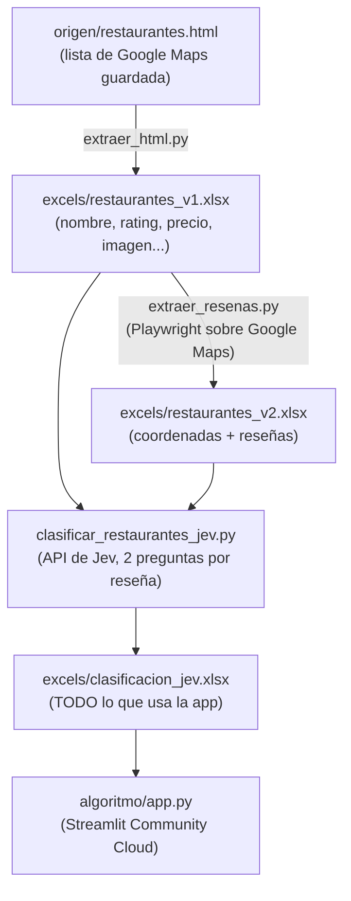
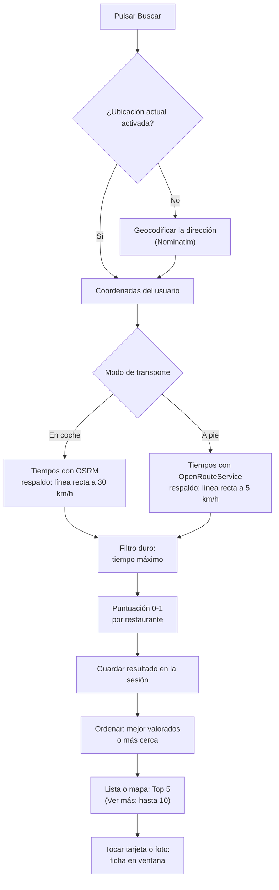

# ¿Dónde comemos hoy?

App web que recomienda, de una lista propia de restaurantes de Google Maps, cuáles encajan mejor con lo que os apetece hoy: presupuesto, tipo de cocina, plato, dónde estáis y cuánto queréis desplazaros (en coche o andando).

Funciona en dos partes independientes:

1. **Obtención de datos** (se ejecuta en local, de vez en cuando): convierte tu lista de Google Maps en un único excel con todo lo necesario, usando el modelo **Jev** (TypeSafe) para clasificar cada reseña.
2. **La app** (Streamlit, desplegada en Streamlit Community Cloud): lee ese excel, pregunta las preferencias y devuelve un ranking con mapa y fichas.

---

## Flujo general



Solo tres scripts, en este orden. Ya no existen `unificar_excels.py`, `analizar_resenas.py` ni `restaurantes_maestro.xlsx`: **Jev sustituye tanto al análisis de sentimiento (antes con `pysentimiento`) como a la unificación de los excels**, y escribe directamente el único archivo que necesita la app.

## Estructura del proyecto

```
proyecto/
├── requirements.txt              # SOLO dependencias de la app (Streamlit Cloud lee este)
├── requirements-dev.txt          # pytest, para los tests
├── .streamlit/
│   ├── config.toml               # tema de la app (claro y oscuro)
│   └── secrets.toml              # claves para probar en local (NO se sube a GitHub)
├── origen/
│   └── restaurantes.html         # HTML de tu lista de Google Maps
├── imagenes/                     # fotos de los restaurantes (las descarga extraer_html.py; se suben al repo)
├── excels/
│   ├── restaurantes_v1.xlsx
│   ├── restaurantes_v2.xlsx
│   └── clasificacion_jev.xlsx    # lo único que necesita la app
├── obtener_datos/
│   ├── requirements.txt          # dependencias de estos 3 scripts
│   ├── extraer_html.py
│   ├── extraer_resenas.py
│   ├── clasificar_restaurantes_jev.py
│   └── .cache/
│       └── cache_jev.jsonl       # resultados ya pagados a Jev (se sube a git: así no se repaga)
├── algoritmo/
│   └── app.py                    # la app web
└── tests/
    ├── test_humo.py              # tests de la app con AppTest
    └── referencia.json           # resultados esperados de 3 búsquedas fijas
```

Todos los scripts calculan sus rutas a partir de su propia ubicación (`Path(__file__)`), así que funcionan lanzados desde cualquier carpeta.

---

## Parte 1 · Obtención de datos

Se ejecuta en este orden, desde la carpeta `obtener_datos/`. Dependencias: `pip install -r obtener_datos/requirements.txt`.

| Paso | Script | Entrada | Salida | Qué hace |
|---|---|---|---|---|
| 1 | `extraer_html.py` | `origen/restaurantes.html` | `restaurantes_v1.xlsx` | Lee con BeautifulSoup cada restaurante de la lista: nombre, puntuación, nº de reseñas, rango de precios, tipo de cocina (el de Google, en bruto), **estado** (cerrado temporal/permanente) y **URL de la imagen**. Además descarga cada foto a `imagenes/` (solo las que aún no estén), porque las URLs de Google caducan en unas semanas. |
| 2 | `extraer_resenas.py` | `restaurantes_v1.xlsx` | `restaurantes_v2.xlsx` | Abre Google Maps con **Playwright** (un navegador real, gratis y sin clave), busca `"nombre, Madrid, España"`, entra en la ficha y lee hasta 30 reseñas por restaurante. Guarda una fila por reseña con el nombre, la URL de la ficha, las coordenadas (sacadas de esa URL) y un `Estado` (`OK`, `NO ENCONTRADO`, `SIN RESEÑAS`, `ERROR`). No trae dirección, teléfono ni web. |
| 3 | `clasificar_restaurantes_jev.py` | los dos anteriores | `clasificacion_jev.xlsx` | Asigna un ID a cada restaurante (por su posición en `restaurantes_v1.xlsx`), le añade la localización cruzando por nombre, y clasifica cada reseña con **Jev**. Es el único script de análisis; genera el excel final completo. |

### Cómo obtener el HTML (paso 1)

1. Abre tu lista de Google Maps en el navegador.
2. Haz scroll hasta que carguen **todos** los restaurantes (la lista se carga poco a poco).
3. Guarda el HTML como `origen/restaurantes.html`.

### Requisitos del paso 2 (Playwright)

No necesita clave ni cuesta dinero, pero sí el navegador de Playwright:

```bash
pip install -r obtener_datos/requirements.txt
python -m playwright install chromium
```

Abre una ventana de Chrome visible y tarda varios minutos (espera entre restaurantes para no saturar a Google). Depende del HTML de Google Maps: si Google lo cambia, el script puede dejar de encontrar las reseñas.

### Cómo funciona el paso 3 (Jev)

Por cada reseña, **una sola llamada** a Jev responde dos preguntas a la vez (así el coste no se duplica):

- **Cocina**: una de las 16 categorías definidas en `CATEGORIAS`, dentro del propio script (o `no_se_sabe` si la reseña no habla de comida).
- **Sentimiento**: `Buena` / `Mala` / `Neutra`.

Por restaurante:
- **Cocina**: gana la más votada entre las reseñas informativas (todas menos `no_se_sabe`); hacen falta al menos 2 para que cuente, si no queda sin categoría. En empate, gana la primera categoría de la lista, y queda marcado.
- **Sentimiento**: recuento simple de reseñas Buenas/Malas/Neutras.
- **Platos destacados**: Jev nunca da esta información (su API solo devuelve la categoría elegida, probabilidades y una confianza). Se calculan en Python: por cada reseña, se busca si alguno de los platos de ejemplo escritos en `CATEGORIAS` (de cualquier categoría, no solo la ganadora) aparece literalmente en el texto, y se cuentan por sentimiento (`Platos mejor/peor valorados`).

Requisitos:

```powershell
pip install -r obtener_datos/requirements.txt
$env:TYPESAFE_API_KEY = "tu_clave"
```

La clave se saca de tu perfil en **app.typesafe.ai** (perfil → API key). Es gratuita, sin tarjeta, con acceso anticipado (el registro de cuentas nuevas puede estar pausado temporalmente).

Uso:

```bash
python clasificar_restaurantes_jev.py --probar "cachopo y cecina espectacular"   # prueba un texto suelto, sin tocar ningún excel
python clasificar_restaurantes_jev.py --limite 3                                # prueba con 3 restaurantes
python clasificar_restaurantes_jev.py                                           # todos
python clasificar_restaurantes_jev.py --reiniciar                               # ignora la caché y recalcula todo
```

**Caché**: cada resultado se guarda en `obtener_datos/.cache/cache_jev.jsonl` en cuanto se calcula. Si cortas la ejecución o la repites, no se paga otra vez por lo ya hecho. La clave de caché es el modelo, una huella de las categorías y las dos preguntas, y el texto de la reseña (no el restaurante: Jev solo ve el texto). Así, reordenar o añadir restaurantes no vuelve a cobrar nada; en cambio, si editas `CATEGORIAS` o `CATEGORIAS_SENTIMIENTO`, se recalcula todo.

**Coste**: Jev cobra 0,042 USD por millón de tokens de entrada (precio de lanzamiento, puede cambiar); la salida es gratis. Para unas 6.700 reseñas, cuenta con menos de 0,50 USD en total. Al terminar, el script imprime el gasto real de esa ejecución.

### Qué contiene `clasificacion_jev.xlsx`

| Hoja | Contenido |
|---|---|
| `Restaurantes` | Todo lo que usa la app: `ID`, Nombre, Puntuación, Nº Reseñas, Rango de precios, Tipo de cocina (Google), Imagen URL, Estado, Dirección, Latitud, Longitud, Teléfono, Web, Categoría (Jev), Categoría 2ª (Jev), % votos, Confianza, Reseñas leídas/informativas/con error, Reseñas buenas/malas/neutras, Platos mejor/peor valorados. |
| `Reseñas` | Una fila por reseña: categoría, sentimiento, probabilidades, confianza y los platos de ejemplo encontrados en el texto. |
| `Platos mencionados` | `ID_Restaurante`, Plato, Categoría del plato, Sentimiento, Fragmento — una fila por cada plato de ejemplo detectado. La usa la app para la búsqueda de "¿Algún plato concreto?". |
| `Configuración` | Modelo, huella de las categorías, fecha, coste, orígenes de los datos. |
| `Categorías` | Las 16 categorías de cocina + las 3 de sentimiento, con su descripción. |

Al ejecutarlo avisa por consola de cualquier restaurante con el **nombre repetido** en `restaurantes_v1.xlsx` (las reseñas de un nombre duplicado se cruzan todas con un solo ID, dejando al otro sin categoría), de reseñas que no se han podido asociar a ningún restaurante, y de restaurantes que se quedan sin `Dirección`.

> El ID es la posición de la fila en `restaurantes_v1.xlsx` (1…N). No es permanente entre versiones: si cambias el orden o el contenido de ese excel, regenera `clasificacion_jev.xlsx` entero.

---

## Parte 2 · La app

Archivo: `algoritmo/app.py`. Al arrancar carga `excels/clasificacion_jev.xlsx` (hojas `Restaurantes` y `Platos mencionados`).

### Lo que ve quien la usa

La interfaz está pensada primero para el móvil (tema en `.streamlit/config.toml`: crema y terracota, Fraunces + Inter, modo claro y oscuro). Tiene dos vistas en la misma página:

**Buscador**, ordenado por lo que más descarta:
1. **Desde dónde salís**: caja con sugerencias mientras escribes (Photon, solo Comunidad de Madrid), o el botón **"Usar mi ubicación"** (el navegador pide permiso; requiere HTTPS, que Streamlit Cloud ya tiene). Con la ubicación activa la caja se desactiva; "Quitar" vuelve a la dirección escrita.
2. **Cómo vais** (coche / a pie) y **tiempo máximo** (5-60 min).
3. **Cocina** (o "Cualquiera"): categorías de Jev.
4. **Presupuesto** por persona (rango 0-100 €; 100 = sin tope).
5. **Más opciones**: plato concreto (opcional), busca en la hoja `Platos mencionados`.
6. **Buscar restaurantes**: botón fijo abajo, al alcance del pulgar.

**Resultados**: barra con "← Cambiar" (vuelve al buscador con todo lo escrito), **Lista | Mapa** y un resumen de lo pedido; debajo, **Mejor valorados | Más cerca** (reordena sin repetir la búsqueda) y las tarjetas compactas. Al tocar una tarjeta o una foto del mapa se abre la **ficha** en una ventana encima.

### Qué pasa al buscar



**Filtros duros.** Solo pasan los restaurantes que cumplen todo lo pedido; si no hay suficientes, no se rellena con otros:
- tiempo de desplazamiento menor o igual al máximo (los que no tienen coordenadas quedan fuera);
- cocina elegida como principal o como secundaria con peso (fuera los de otra cocina y los no clasificados);
- rango de precio que se cruce con el presupuesto (los que no tienen precio pasan, porque no se puede saber);
- si pediste plato, menciones positivas de ese plato en las reseñas.

**Puntuación.** Cada restaurante recibe un score entre 0 y 1 combinando cinco componentes. Los pesos están al principio de `app.py` (`PESO_*`) y se pueden cambiar:

| Componente | Peso | Cómo se calcula |
|---|---|---|
| Precio | 0.15 | Solapamiento entre tu rango de presupuesto y el rango de precios del restaurante (0.5 si alguno no tiene rango). |
| Cocina | 0.30 | Ver más abajo, "Cómo puntúa la cocina". |
| Plato | 0.20 | Menciones del plato pedido en `Platos mencionados`: proporción de menciones positivas más un pequeño bonus por volumen. 0 si no pediste plato o no aparece. |
| Calidad | 0.30 | 60 % puntuación de Google (sobre 5) + 40 % proporción de reseñas "Buenas" (de Jev). Si no hay reseñas analizadas, solo la puntuación de Google. |
| Nº de reseñas | 0.05 | Volumen de reseñas relativo al restaurante con más reseñas (señal de confianza). |

**Cómo puntúa la cocina.** El desplegable ofrece las categorías de Jev, pero no todos los restaurantes tienen una (hace falta un mínimo de reseñas informativas). Por eso el encaje se calcula así:
- **1.0** si es la categoría principal del restaurante (o hay empate con la segunda).
- **0.6** si es la categoría secundaria, y esta tiene al menos el 25 % de los votos.
- **0.0** si tiene otra categoría distinta.
- **Sin categoría de Jev**: se compara la elegida contra el `Tipo de cocina` de Google, por **raíz de palabra** (no por frase completa, porque "Asiática (otras)" casi nunca aparece tal cual en el texto de Google, pero "asiat" sí encaja con "Asiática, Fusión"). Si coincide, 1.0; si no, 0.3 (ni sí ni no, para no descartarlo del todo).

**Resultado.** Se muestran 5; **Ver más** amplía a 10 (y no aparece si no hay más que encajen). Si hay menos de 5, se avisa ("Solo hay 3 que encajan"). Si no hay ninguno, se ofrecen atajos: ampliar el tiempo, cualquier cocina o quitar el plato.
- **Tarjeta** (componente propio, horizontal): foto pequeña, nombre, cocina, precio, nota y minutos. Los cerrados temporal o permanentemente salen atenuados y con etiqueta.
- **Ficha** (`st.dialog`): foto grande, cocina, precio, nota, tiempo, dirección, información del plato pedido, platos destacados, **Cómo llegar** (ruta en Google Maps) y enlaces a Instagram, TikTok y Google (búsquedas de Google limitadas a cada red, porque ninguna de las dos permite buscar sin iniciar sesión). El score no se muestra.

### El mapa

- Componente propio (Streamlit Components v2) con **Leaflet**. Cada restaurante es su **foto redonda** con el número de posición (el mismo que en la lista; el nº 1 en dorado). Tu ubicación es el punto azul.
- **Mapa base:** OpenFreeMap "Positron" (vectorial, sin clave), dibujado con MapLibre GL. Si el navegador no puede (sin WebGL, sin acceso a OpenFreeMap, tarda más de 12 s), cae automáticamente a **OpenStreetMap**.
- **Tocar una foto** resalta el pin y abre su ficha; tocar en un hueco quita la selección. El zoom que pongas se conserva. Ocupa el 60 % de la altura de la pantalla.
- Si no hay resultados, el mapa muestra solo tu ubicación: sirve para comprobar que la app te ha situado donde esperabas.

### Estado de la sesión

Los resultados se guardan en `st.session_state` para que "Ver más", cambiar el orden o la vista, o tocar el mapa no repitan toda la búsqueda. Claves principales: `vista` (buscador/resultados), `resultado`, `num_mostrados`, `restaurante_seleccionado`, `ficha_abrir`, `ubicacion_actual`. El formulario se dibuja siempre (en resultados solo se oculta con CSS) para no perder lo escrito.

---

## Configuración y claves

| Clave | Dónde | Para qué | Obligatoria |
|---|---|---|---|
| `TYPESAFE_API_KEY` | Variable de entorno (local) | Clasificar con Jev (paso 3) | Solo al ejecutar el paso 3 |
| `ORS_API_KEY` | Secretos de Streamlit | Tiempos reales andando (OpenRouteService, plan gratuito) | No: sin ella, "a pie" estima por línea recta a 5 km/h y avisa |

Secretos en local: fichero `.streamlit/secrets.toml` en la raíz del proyecto:

```toml
ORS_API_KEY = "tu-clave"
```

Secretos en Streamlit Cloud: **Manage app → Settings → Secrets**, misma línea. `.streamlit/secrets.toml` ya está en `.gitignore`: no se sube nunca.

---

## Ejecutar y desplegar

**En local**

```bash
pip install -r requirements.txt
streamlit run algoritmo/app.py
```

**Tests** (cargan la app con AppTest y lanzan búsquedas reales, ~40 s):

```bash
pip install -r requirements-dev.txt
pytest tests/
```

Si cambias a propósito los datos o la puntuación, los resultados esperados cambian: regenera la referencia con `REGENERAR_REFERENCIA=1 pytest tests/test_humo.py`.

**Desplegar en Streamlit Community Cloud**

1. Sube el proyecto a un repositorio de GitHub (`excels/clasificacion_jev.xlsx` incluido; puede ser privado).
2. En share.streamlit.io: *New app* → repositorio y rama → **Main file path: `algoritmo/app.py`**.
3. El `requirements.txt` de la **raíz** debe contener solo lo que necesita la app:

```
streamlit
pandas
openpyxl
geopy
requests
pillow
```

   Las dependencias de la obtención de datos van en `obtener_datos/requirements.txt`; si acaban en el de la raíz, el despliegue se vuelve lento o falla.
4. La ruta del *Main file path* no se puede editar después: para cambiarla hay que borrar la app y volver a crearla (se puede reutilizar el subdominio).
5. Tras subir cambios se redespliega solo (o *Reboot app* en *Manage app*). Como `cargar_datos()` se cachea en memoria, si solo cambias el excel y no el código, a veces hace falta *Reboot app* para que la app se entere. Si la página sale en blanco justo después de un despliegue, recárgala.

**Actualizar los datos:** vuelve a ejecutar `clasificar_restaurantes_jev.py` (basta con este si `restaurantes_v1.xlsx` y `restaurantes_v2.xlsx` no han cambiado), sube el nuevo `clasificacion_jev.xlsx` y redespliega.

---

## Servicios externos

| Servicio | Uso | Clave | Nota |
|---|---|---|---|
| Photon (komoot) | Sugerencias mientras escribes la dirección | No | Lo llama el navegador directamente; solo Comunidad de Madrid. |
| Nominatim (OpenStreetMap) | Convertir la dirección escrita en coordenadas (si no eliges sugerencia) | No | Limitado a la Comunidad de Madrid; algunos números de portal no los tiene. |
| OSRM (servidor demo) | Tiempos en coche | No | Servicio compartido sin garantías; si falla se estima por línea recta a 30 km/h. |
| OpenRouteService | Tiempos andando | Sí (gratuita) | Su matriz a pie falla a veces con un error interno; en ese caso se estima por línea recta a 5 km/h. |
| OpenFreeMap / OpenStreetMap | Mapa base | No | Se cargan junto con Leaflet y MapLibre desde jsDelivr. |
| Google Maps | Fotos (paso 1) y reseñas con coordenadas (paso 2) | No | Las URL de las fotos caducan en semanas: por eso se descargan a `imagenes/`. |
| Google (búsquedas) | Enlaces de la ficha: nombre, Instagram, TikTok y "Cómo llegar" | No | |
| **Jev (TypeSafe)** | Clasificar cocina y sentimiento de cada reseña | Sí (gratuita, acceso anticipado) | Modelo en fase temprana; el registro de cuentas nuevas puede estar pausado. Solo en el paso 3. |

---

## Limitaciones conocidas

- **Restaurantes cerrados:** salen en los resultados, atenuados y con la etiqueta "Cerrado temporalmente/permanentemente" (columna `Estado`).
- **Cobertura de platos:** la búsqueda de "¿Algún plato concreto?" y los "platos destacados" solo reconocen los platos escritos como ejemplo dentro de `CATEGORIAS` (bastantes, pero no genéricos como "pan" o "postre": esos no ayudan a distinguir una cocina y por eso no están ahí).
- **Enlaces de Google del nombre:** buscan siempre "nombre + Madrid". Para restaurantes de otros municipios (Majadahonda, Patones...) conviene usar la dirección real; pendiente.
- **Geocodificación:** la búsqueda está limitada a la Comunidad de Madrid, pero algunos números de portal no están en OpenStreetMap y se toma otro punto de la misma calle. Elige una sugerencia de la lista o comprueba "Te he situado en" encima de los resultados.
- **Jev es un modelo en acceso anticipado:** su documentación indica que rinde mejor en inglés; en español conviene revisar de vez en cuando la hoja `Reseñas` para detectar clasificaciones raras. Su comportamiento, precios y límites pueden cambiar sin aviso.
- **Nombres duplicados:** si un restaurante aparece dos veces en `restaurantes_v1.xlsx`, todas sus reseñas se cruzan con un solo ID y el otro se queda sin categoría (el script avisa de esto por consola).
- **IDs:** cambian si cambia el orden de `restaurantes_v1.xlsx`. No afecta a la caché de Jev (su clave no lleva el ID) ni a la app (los IDs solo viven dentro de una búsqueda).

---

## Problemas frecuentes

| Síntoma | Causa y solución |
|---|---|
| `ModuleNotFoundError: No module named 'bs4'` | Falta instalar las dependencias de `obtener_datos/`: `pip install -r obtener_datos/requirements.txt`. |
| `Executable doesn't exist` al ejecutar `extraer_resenas.py` | Falta el navegador de Playwright: `python -m playwright install chromium`. |
| `No encuentro la variable de entorno TYPESAFE_API_KEY` | Defínela en la misma ventana de terminal donde ejecutas `clasificar_restaurantes_jev.py`. La clave sale de tu perfil en app.typesafe.ai. |
| `ERROR: no hay ninguna reseña que clasificar` | El script imprime un diagnóstico (filas leídas, con texto, cruzadas por nombre). Suele ser que `restaurantes_v1.xlsx` se regeneró con nombres distintos a los de `restaurantes_v2.xlsx`: compara los nombres de ejemplo que muestra el error. |
| Aviso de "nombre repetido" en `restaurantes_v1.xlsx` | Ese restaurante aparece dos veces; borra la fila duplicada y vuelve a ejecutar `clasificar_restaurantes_jev.py`. |
| Aviso amarillo sobre `ORS_API_KEY` | No hay clave de OpenRouteService en los secretos: el modo "a pie" estima por línea recta. Añádela para tiempos reales. |
| "Nada por aquí" | Usa los atajos (ampliar el tiempo, cualquier cocina, sin plato) o mira "Te he situado en": quizá la dirección se ha geocodificado en otro sitio. |
| El botón "Usar mi ubicación" no funciona | El navegador debe tener permitida la ubicación para la página (icono del candado) y la página debe servirse por HTTPS o `localhost`. |
| El mapa muestra OpenStreetMap en vez de Positron | El mapa vectorial no se pudo cargar (sin WebGL o sin acceso a OpenFreeMap): es el respaldo automático, no un error. |
| Página en blanco, error 404 en consola, o la app no refleja un excel nuevo | Recarga la página; si no, dale a "Reboot app" desde "Manage app" en Streamlit Cloud. |